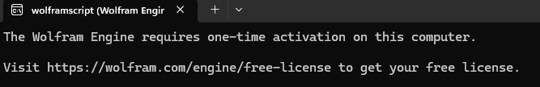
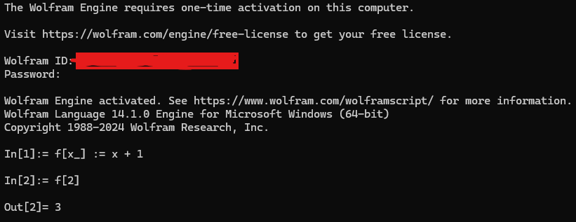
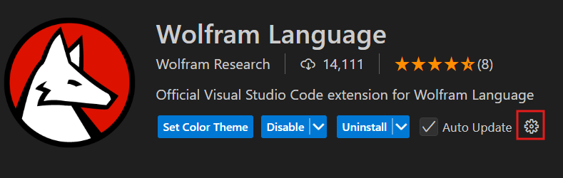
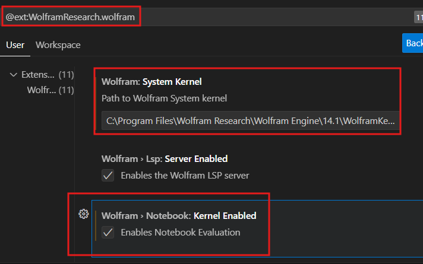
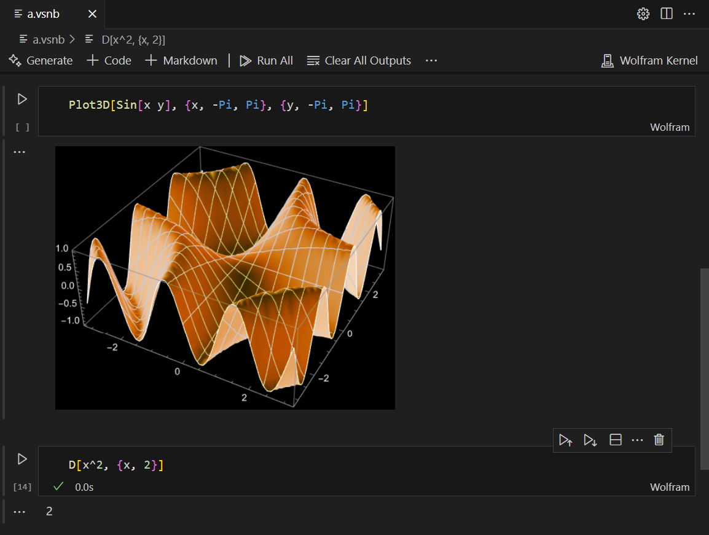
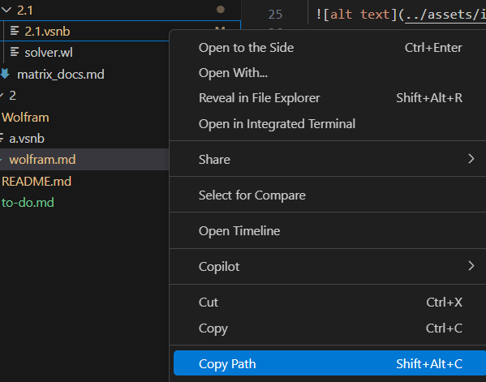

# Installation

1. Install [Wolfram Engine](https://www.wolfram.com/engine/index.php.es?source=footer), run it, and activate your free developer account. You can create your account in [Wolfram Cloud](https://www.wolframcloud.com/). Open the free-license url and enter your credentials.

2. Locate the Wolfram Kernel Executable e.g. 
`"C:\Program Files\Wolfram Research\Wolfram Engine\14.1\WolframKernel.exe"`

3. Install a VSCode extension like [this](https://marketplace.visualstudio.com/items?itemName=WolframResearch.wolfram) that supports `.wl` and `.vsnb`.

4. Configure the kernel

5. Download the [zip](https://github.com/WolframResearch/WolframLanguageForJupyter?tab=readme-ov-file#method-1-using-wolframscript) and follow the steps for windows.

6. Finally create a `.vsnb` file and test the installation

 

# Links to learn the language

- [Fast introduction for programmers](https://www.wolfram.com/language/fast-introduction-for-programmers/en/)

- [An Elementary Introduction to the Wolfram Language Third Edition](https://www.wolfram.com/language/elementary-introduction/3rd-ed/)

# Running .wl in .vsnb

For improved code organization, certain modules are stored in separate `.wl` files. When a `.vsnb` file uses a `.wl` file, it will include a cell containing `<< "full path of the .wl"`. To ensure proper execution, replace that with the actual file path on your system. Use [`path.py`](../path.py) to replace the `\`.

